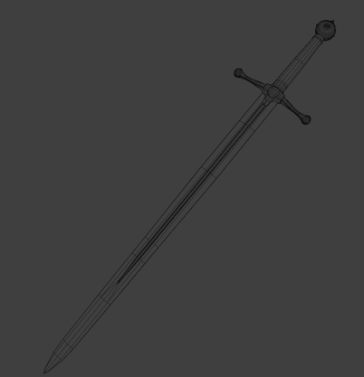
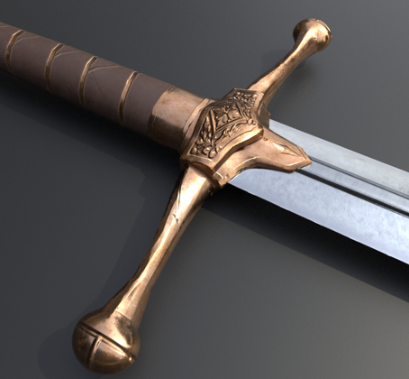
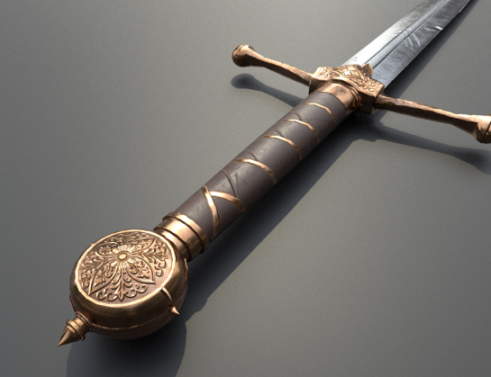
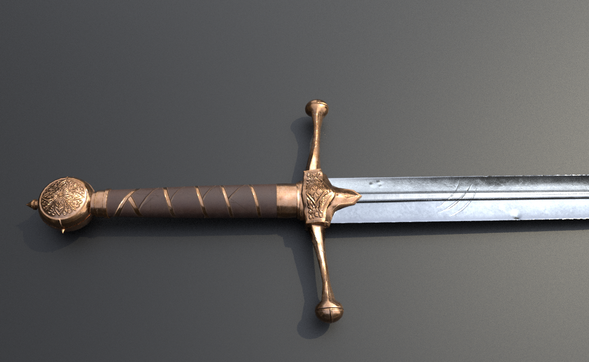
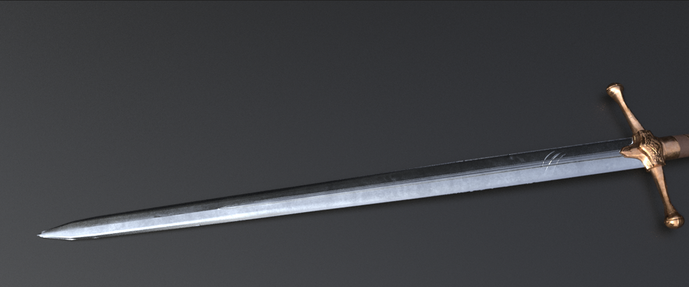

--Language-- English --Language--

[Download Model](https://drive.google.com/file/d/1MxVVYxrMp8rRlnl7XHA_74fEYyzD2DRH/view?usp=sharing)

5,300 triangles · PBR workflow

--Language-- 中文 --Language--

[【下载模型】](https://drive.google.com/file/d/1MxVVYxrMp8rRlnl7XHA_74fEYyzD2DRH/view?usp=sharing)

5300 三角面，PBR 流程

--Language-- 日本語 --Language--

[【モデルをダウンロード】](https://drive.google.com/file/d/1MxVVYxrMp8rRlnl7XHA_74fEYyzD2DRH/view?usp=sharing)

三角面 5300、PBR ワークフロー

