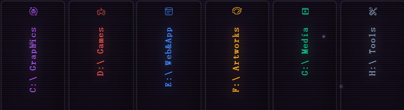
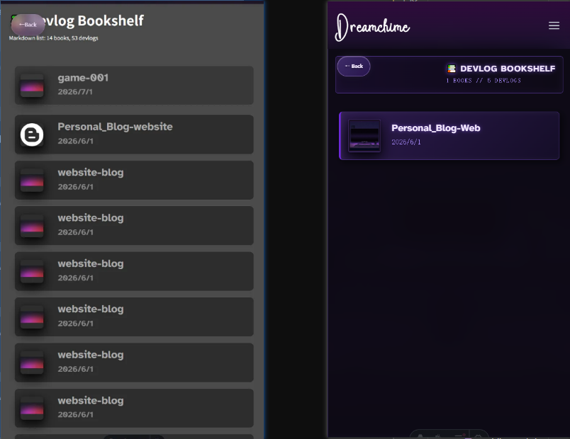
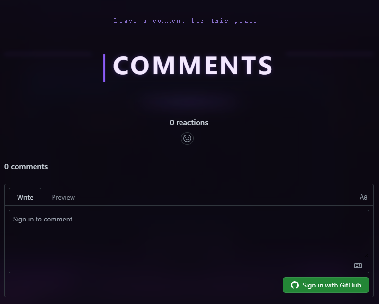
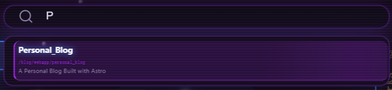

--Language-- English --Language--

> **WOW**! Not only did you find this blog, you even opened the post *about* this blog—on the blog itself!

Weird as that is, here's the address anyway: <https://littledreamchime.github.io>

---

## Why this blog?

Lately I've had a lot I want to make—learn to draw, try some 3D modeling, study Shader, edit a video, build a game? I wanted one place to showcase everything I'd make in the future, and a blog felt perfect. I looked at plenty of other blogs and templates: some are silky-smooth and gorgeous, some are plain—but none of them were what I wanted. **Too generic and ordinary!**

I planned to skip templates and build something distinctive myself, and pick up some front-end skills along the way. So this blog was born—smooth page transitions, a little light pollution, and all. It's modeled after the computer desk of my dreams. Aside from not being too kind to low-end phones, I'm already very happy with the overall result.

---

## What's on the blog

The blog has four pages: <kbd>Home</kbd>, <kbd>Blog</kbd>, <kbd>Devlog</kbd>, and <kbd>About</kbd>. Page jumps use smooth transitions so you barely feel like you're navigating at all (assuming a decent connection, of course).

### Blog

Anyway, I might add more sections later—or abandon one forever? I can't say for sure, but I hope I can slowly fill this place up.

### Devlog
The `devlog` section is for development logs of programs that are **too big to finish in one go**.

### About
The `About` page is my self-introduction—feel free to take a look if you're curious.

---

## Building the blog

I originally planned about a month for the blog. Looking back, that turned out roughly right.

#### At the start:
I worked on it on and off for a few days until I hit a wall—**the blog had already outgrown my mental capacity!** I had to stop and spend several days organizing the development logs. Those logs turned this month of building the blog into five stages:

##### <kbd>[Stage 1: Organizing Docs]</kbd>
Yes—just organizing this blog's development logs took me a full eight days. Luckily I'd recently taken the Software Designer exam and picked up a few basics.

Over those eight days I cataloged the bugs I'd already found, then drew something that isn't quite a component diagram or a class diagram—but it ran through almost my entire development process, kept me from getting lost, and gave me a rough sense of how front-end work fits together.

##### <kbd>[Stage 2: Building the Blog page]</kbd>
This was the hardest part for me. On one hand, the monitor sits in the center of the screen from the start and stays visible during page switches, so layering had to be managed carefully. On the other, for mobile I chose to rotate the screen 90 degrees—no small challenge for layout, and the stage with the most bugs.

From here on, the site's v1.0 features were officially done; everything left was bug fixes and polish.

##### <kbd>[Stage 3: About page & bug fixes]</kbd>

Most of this was reusing the earlier Page setup with style tweaks—very straightforward!

##### <kbd>[Stage 4: Mobile adaptation & UI restyle]</kbd>

The project moved along steadily until every feature was done and the bugs were fixed—then I realized the interface was just too ugly!

So I enlisted the power of AI, which is great at CSS, and it easily refreshed my styles. The UI went roughly from this (left) to this (right), with lots of animation, glow, and frosted-glass effects added.

Finally, the blog gained two more features:

##### <kbd>[Stage 5: Search & comments]</kbd>

By then it was time to stop building the blog! With a tight schedule, I went straight with GitHub's native `Giscus`—my site is already deployed on GitHub, so it was the easiest option. Ugly? Sure. But does it work? You tell me.

Of course, I'll eventually replace it with something that works without logging in.

With search added: it's a pretty complete version now. I'll put a comma on blog development here for now.

---

## Plans for this blog going forward?

Of course, a few things still catch my eye:
- Is the home screen *only* a home screen? No other features—weather, time, a little alarm clock?
- Since it's a computer, that home-page PC might later play webGL Unity projects, art pieces, interactive toys, and more.
- On first visit the blog loads all resources, but after sitting idle a few minutes the device may clear them, so jumping between pages still feels laggy!
- Language switching—I'll master Chinese, Japanese, and English (￣︶￣*))
- And that comment system I mentioned earlier!

> **But!**
> 
> That's all for later!

If you'd like to be friends or have other questions, feel free to reach out: [`littledreamchime@gmail.com`](mailto:littledreamchime@gmail.com)

**Hope this blog can carry my creativity and keep going for a long time.**

--Language-- 中文 --Language--

> **WOW**！你不仅找到了这个博客网站，并且点开了博客网站上这个关于这个博客网站的博客！

虽然很奇怪，但还是要在这里贴上地址：<https://littledreamchime.github.io>

---

## 为什么会有这个博客？

最近有很多东西想做，比如学学画画、做几个建模、学学 Shader、剪个视频、做个游戏？我想给将来要做的东西一个集中展示的地方，博客网站就再合适不过了！我看了很多其他博客网站和模版，有的界面很丝滑很好看，有的很平淡，但这都不是我想要的，**太笼统且普通了！**

我计划不用模版，自己做一个独特点的出来，顺便学习一下前端的知识！于是，这个可以丝滑转场，有点光污染的博客诞生了！它是一个我梦想中的电脑桌为原形，除了没太照顾低配手机端的性能问题，整体效果我已经非常满意了。

---

## 博客的内容

这个博客分为 <kbd>Home</kbd>, <kbd>Blog</kbd>, <kbd>Devlog</kbd> 和 <kbd>About</kbd> 这四个页面，而且采用丝滑的转场进行跳转页面，让用户丝毫没有在跳转的感觉呢（当然是网速稍微好一点的情况下）。

### Blog

总之，这些以后还可能添加板块，或者某个板块就被永久弃用了？我也说不准，但希望我能慢慢填满这个地方。

### Devlog
`devlog` 界面用来放那种 **大到没办法一口气做完** 的程序的开发日志。

### About
`About` 界面则是我的自我介绍，感兴趣也可以去看看哦。

---

## 开发博客的经历
留给开发博客的时间，最开始计划的是一个月，最后看来也差不多。

#### 最开始：
我陆陆续续做了几天，直到一个节点，**发现博客的规模已经超出我的脑容量了**！我才不得不停下来，整理了几天的开发日志。这些开发日志也把我开发博客的这一个月整理成了五个阶段：

##### <kbd>[第一阶段：整理文档]</kbd>
是的，整理这个博客的开发日志我就足足花了八天，碰巧之前考了软件设计师，学了点皮毛。

于是这八天里：我整理了当时已经找出来的 bug；然后，做了这个么一个不像组件图也不像类图的东西，但是它几乎贯穿了我的开发，让我不至于晕头转向的，也让我大概知道怎么做前端了。

##### <kbd>[第二阶段：构建Blog页面]</kbd>
这个部分对我来说是最难的部分了，一方面，这个显示器是一开始就放在屏幕中间的，且在切换页面的时候随时可以看到，层级关系要管理清楚；另一方面，为了适配移动端，我选择将屏幕旋转 90 度，这对网页布局属实是不小的挑战，bug 最多的一集。

从这里开始，网站 v1.0 的功能已经正式完成了，剩下的都是修 bug 和打磨。

##### <kbd>[第三阶段：做About页面，修bug]</kbd>

这里大多数就是之前Page页面的复用了，只是改了改样式，非常简单！

##### <kbd>[第四阶段：页面的移动端适配，替换ui样式]</kbd>

项目稳定地推进着，直到最后所有功能完成，bug修好；我发现，现在的界面太丑了！

于是，我动用了AI大人的力量，它做css最拿手了，轻松地将我的样式翻新了一遍。界面大概从这个样子（左图），变成了这样（右图），又加了许多动画和辉光、毛玻璃效果。

最后，我的博客又新增了两个功能：

##### <kbd>[第五阶段：搜索功能，评论功能]</kbd>

这个时候，到我该停止做博客的时间了！时间紧任务重，我直接用了 Github 的原生 `Giscus`，正好我的网站直接部署在github上，用这个最省事了！虽然很丑，但你就说能不能用吧。

当然，后续我肯定要将它改成不用登陆也能用的功能。

再加上搜索功能后：现在已经是一个非常健全的版本了，我的博客开发到此画上个逗号吧。

---

## 之后关于这个博客的计划？

当然了，现在最惹我眼的问题还是有的：
- 主界面只是主界面，没有其他功能吗？比如天气、时间、摆个闹钟什么的？
- 既然是电脑，之后这个主页的电脑可能会用来播放webGL unity项目、绘画作品、交互小物件等等。
- 在最开始进入博客的时候，会把所有的资源加载好，但是发呆几分钟，设备可能就把这些资源清除了，导致再次互相跳转时还是会很卡！
- 语言切换功能，我将精通中日英三语(￣︶￣*))
- 还有之前提到的评论系统！

> **但！**
> 
> 这都是后话了！

如果想交个朋友或有其他问题，欢迎联系我：[`littledreamchime@gmail.com`](mailto:littledreamchime@gmail.com)

**希望这个博客网站能承载着我的创造力，一直走下去吧。**
