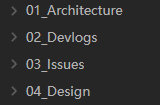
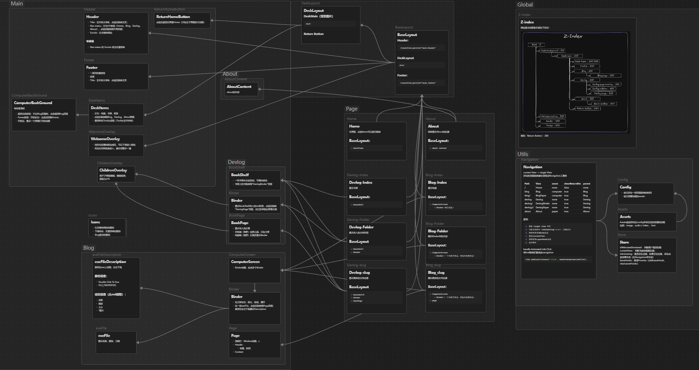

##### Duration: Jun 01 2026 - Jun 08 2026
##### Tags: `#Docs` `#Architecture` 
## Context & Goals
- Recently, the underlying logic of the project started getting chaotic, leading to an increasing number of bugs. I realized I needed to take a step back, untangle the mess, and plan the next steps.
- Clear my mind, establish a solid foundation, and build a habit of writing continuous dev logs.
- To be completely honest, the codebase was turning into ~~a piece of shit~~ spaghetti code. If I didn't stop to refactor and organize things now, it would eventually become an unmanageable pile of technical debt.
## Approach & Decisions
I decide to divide the project documentation into four core modules:

- Architecture: Documenting Components, Layout, Utils, Z-index management and the relationships between them.
    
- Dev logs: A dedicated space to track progress over time.
- Issues: A temporary tracker for development roadblocks, their resolution status, and any newly derived bugs.
- Design: Planning the website layout and CSS implementation strategies.
## The Result
- Identified and cataloged a series of underlying logic issues.
- Created comprehensive component diagrams to map out the operational logic visually.
- Established a standardized documentation process for future development.
## Next Steps
- Start tackling and resolving the backlog of issues identified during this documentation phase.