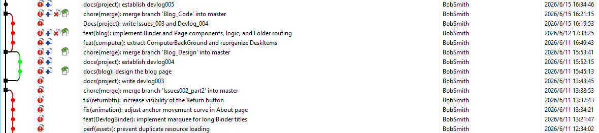
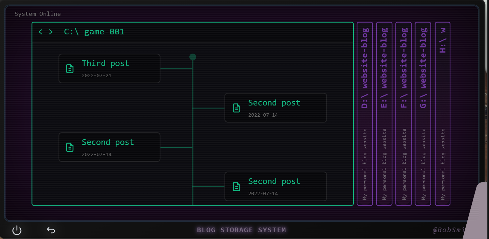

##### Duration: Jun 08 2026 - Jun 15 2026
##### Tags: `#Code` `#Design` `#Refactor` `#fix`

## Context & Goals
Coming off the documentation and component-mapping phase, I had a significant backlog of issues to tackle. The overarching goals for the past week were to:
- Resolve the bugs identified in the previous phase ( Issues_001 & Issues_002 ).
- Establish and strictly enforce standard Git workflows.

- Fully design and implement the logic and UI for the new Blog section.
## Approach & Decisions
1. Bug Fixes & Optimizations
	 - Resource Preloading: Now, all necessary resources are loaded upon the initial visit to the site, which ensures that transition is incredibly smooth.
	 - Refactoring: Extracted several bloated components into smaller, reusable ones. The codebase looks much cleaner now.
	 - Rewrite some CSS styles.
2. Building the Blog Section
## The Result
- A Beautiful Git History:

- Blog UI Completed:

## Next Steps
- Squash the newly logged bugs in Issues_003.
- Refine and finalize the code for the "About" page.
- Prepare and integrate the final image assets into the UI.