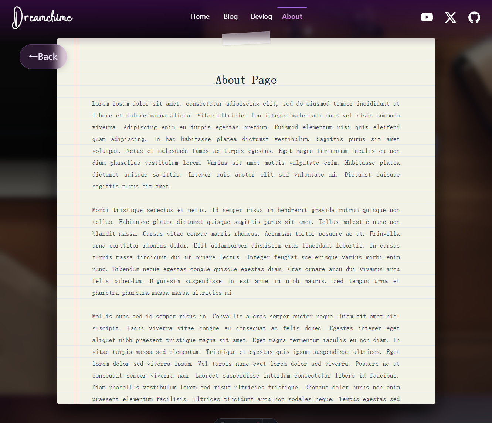

--Language-- English --Language--

##### Duration: Jun 15 2026 - Jun 21 2026
##### Tags： `#Fix` `#Layout` `#Design` `#Code`
## Context & Goals:
With the core components in place, this phase was all about refinement and visual preparation. Main objectives here:
- Clear the bug backlog from Issues_003.
- Design and implement the layout for the "About" page.
- Run experiments and lay the groundwork for embedding actual image assets into the UI.
## Approach & Decisions:
- Detail-Oriented Fixes: I focused heavily on polishing the micro-interactions and visual bugs.
- Continuous Tracking: any newly discovered UI quirks or edge cases were immediately aggregated into a new tracker ( Issues_004 ).
## The Result：
- Resolved bugs:
	 - Tooltip Positioning.
	 - Marquee Bug in Devlog-Binder section.
	 - Mobile Responsiveness: ensured the Blog section scales and displays perfectly on narrow viewports.
- Designed and implemented the About page.
	
- Added a utility function to fetch optimized image URLs, prepping the system for image loading.
``` js
export async function getOptimizedImageUrl(
  src: ImageMetadata,
  format: 'webp' | 'avif' | 'png' | 'jpeg' = 'webp'
) {
  const optimized = await getImage({ src, format });
  return `url(${optimized.src})`;
}
```
## Nest Steps：
- Tackle the minor UI quirks and bugs accumulated in Issues_004.
- Launch and put the blog into use.
- Shift focus to art direction: illustrate custom image assets and polish the overall visual aesthetics of the site.

--Language-- 中文 --Language--

##### 时间：Jun 15 2026 - Jun 21 2026
##### Tags： `#Fix` `#Layout` `#Design` `#Code`
## 背景与目标：
核心组件就位之后，这一阶段主要是打磨与视觉准备。主要目标：
- 清掉 Issues_003 里积压的 bug。
- 设计并实现 About 页面布局。
- 做实验，为把真实图片资源嵌入 UI 打下基础。
## 方法与决策：
- 细节向修复：重点打磨微交互和视觉类 bug。
- 持续跟踪：新发现的 UI 怪癖或边界情况立刻汇总进新的跟踪清单（Issues_004）。
## 成果：
- 已解决的 bug：
	 - Tooltip 定位。
	 - Devlog-Binder 区域的跑马灯 bug。
	 - 移动端适配：确保 Blog 板块在窄屏上也能正确缩放与展示。
- 设计并实现了 About 页面。
	
- 新增用于获取优化后图片 URL 的工具函数，为图片加载做准备。
``` js
export async function getOptimizedImageUrl(
  src: ImageMetadata,
  format: 'webp' | 'avif' | 'png' | 'jpeg' = 'webp'
) {
  const optimized = await getImage({ src, format });
  return `url(${optimized.src})`;
}
```
## 下一步：
- 处理 Issues_004 里积累的小 UI 问题与 bug。
- 上线并真正把博客用起来。
- 重心转向美术方向：绘制自定义图片资源，并打磨整站视觉质感。
