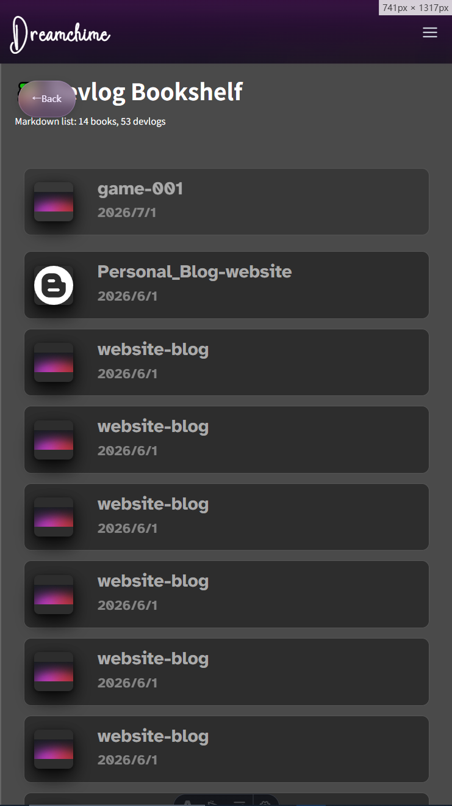
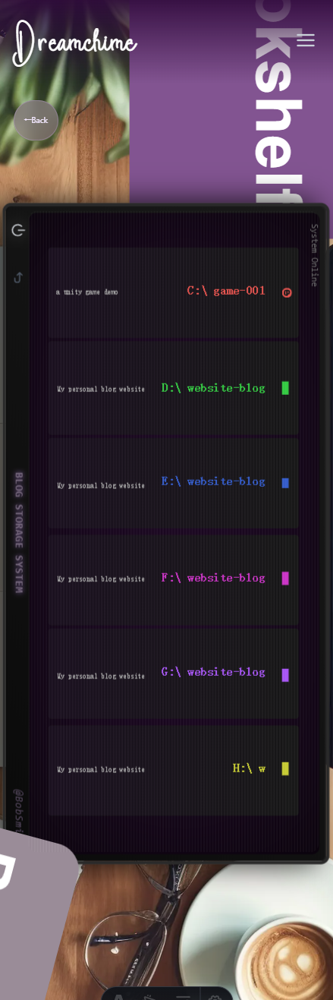
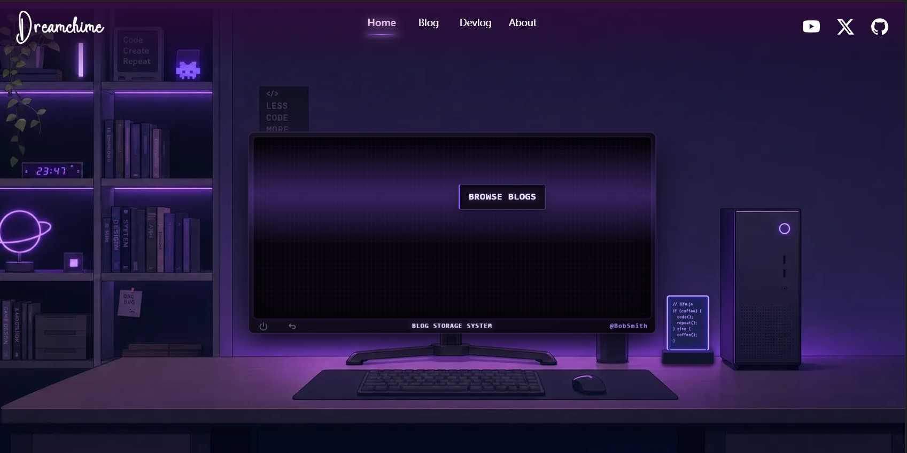

##### Duration: Jun 21 2026 - Jun 27 2026
##### Tags: `#Assets` `#Fix` `#Code` 
## Context & Goals:
With the core logic and layouts completed, it is time to bring everything together. The main objectives for this phase were:
-  Squash the remaining bugs logged in Issues_004.
- Polish the visual assets and set up the image integration pipeline.
- Get the Blog fully operational and ready for actual use.
## Approach & Decisions:
- Bug Squashing: Dedicated time to fix the vast majority of minor UI quirks and image rendering issues from the tracker.
- The "Placeholder" : Instead of delaying the blog's launch to wait for the final illustrations, I Decided to use temporary color blocks for all inserted images.
## The Results:
- Polished minor UI details and fully implemented mobile responsiveness.

  
  
- Better-looking CSS styles!

 
- Version 1.0 released.
- Established Issues_005.
## Next Steps:
- Art Production: Put on my artist hat and illustrate all the required custom art assets to replace the temporary color blocks.
- Resolve the issues and functionalities identified in Issue 005 during development and testing.
- Release version 1.1 for the general public.