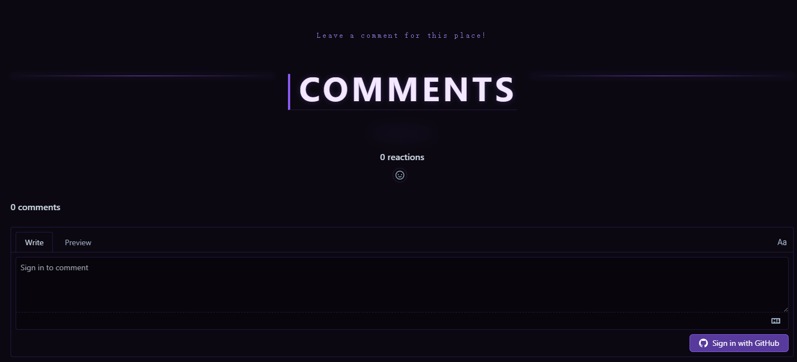
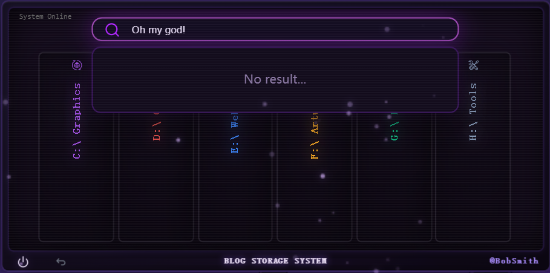

##### Duration: Jun 27 2026 - Jun 30  2026
##### Tags: `#Assets` `#Fix` `#Code` `#Layout` `#Architecture` 
## Context & Goals:
This update is all about leveling up the blog's overall performance and user experience. I've broken down the goals into four main areas:
- Squashing Bugs & Polishing Logic: Fixed several annoying issues.
- Interactive New Features: Implemented a comment system and a search bar.
- Performance Boosts: Enhanced mobile responsiveness.
- Visual Upgrades: Spruced up the UI with some cool glowing particle effects and elegant device mockups.
## Approach & Decisions:
- Categorized blogs into the following types:
	 Shaders, Videos, Games, Tools, Arts, Webs
- Restructured the image assets.
- Optimized the loading logic.
- Enabled article search by title, path, or name.
- Integrated the Giscus comment system.
## The Results:
- Comment system:
  
- Search article:
  
- Added support for displaying post cover images on both the Description and Page views.
## Next Steps:
- Breathe life and a vibrant soul into this blog!
- To be Continued